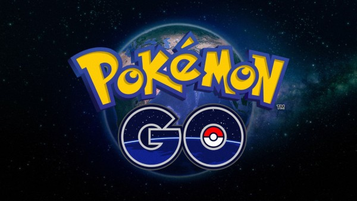
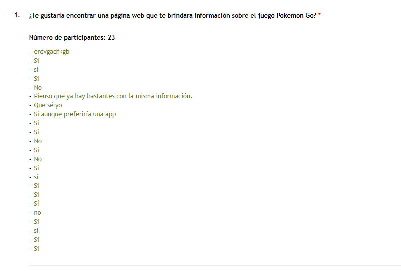

# POKEMONNET

## Índice

* [Introducción](#introducción)
* [Desccripción del Producto](#descripción-del-producto)
* [POKEMONNET definición de usuario](#POKEMONNET-definición-de-usuario)
* [Proceso del diseño](#proceso-del-diseño)
* [Herramientas](#herramientas)
* [Autoras](#autoras)
***

## Intraducción :
Pokemon Go es un videojuego creado por Niantic, Inc. El juego consiste en buscar y capturar personajes de la saga Pokémon escondidos en ubicaciones del mundo real y luchar con ellos, lo que implica desplazarse físicamente por las calles de la ciudad para progresar. La aplicación comporta un elemento de interacción social, ya que promueve reuniones físicas de los usuarios en distintas ubicaciones de sus poblaciones.

## Descripción del Producto:

POKEMONNET es una página web que esta diseñada para que sus usuarios conozcan sobre que es pokemon y obtengan informacion de cada uno de ellos. En esta web los usuarios podran visualizar a los 151 pokemons, ordenarlos alfabéticamente (ascendente y descendente),filtrarlos por tipo (15 clasificaciones) y tambien encontraras la opción de calcular cuantos pokemons le falta capturar al usuario.

## POKEMONNET definición de usuario :

Principiantes, personas que no hayan jugado anteriormente Pokemon Go, que quieran tener informacion básica sobre pokemons por eso hemos creado una pagina amigable con informacion importante para que el usuario se sienta comodo al usarlo. 

### Encuestas y Resultados

Realizamos la siguente encuesta a 23 personas, en su mayoria personas que tenian un poco de conocimientos sobre Pokemon Go, esta misma nos ayudo a aclarar nuestras ideas y enfocarnos en los datos mas útiles para nuestros usuarios, sabiendo que eran ususarios principiantes y que necesitaban una pagina amigable y que sea facil de usar.

### Entrevistas de Usuarios

#### Entrevista N° 1

#### Entrevista N° 2

#### Entrevista N° 3

### Historia de Usuario

#### Historia N° 1
Yo como usuario principiante, quiero ver la información general sobre los POKEMON, para conocer y obtener informacion mas detallada sobre ellos.

#### Historia N° 2
Yo como usuario, quiero poder ordenar los nombres de los Pokemons en forma ascendente (A-Z) y descendente (Z-A), para poder ubicarlos mas rapido.

#### Historia N° 3
Yo como usuario, quiero poder filtrar por tipo a los Pokemons, para tener mas informacion sobre ellos.

#### Historia N° 4
Yo como usuario, quiero saber cuantos pokemons me faltan capturar, para poder pasar a un siguiente nivel

## Proceso del diseño:

### Prototipo de baja calidad
  

### Prototipo de alta calidad
  

### Testeos de Usabilidad
En este proyecto pudimos testear con 3 persona de diferentes edades a las cuales entrevistamos y le explicamos como sería nuestra pagina web

## Herramientas

### Tablero "KANBAN"

### Cuadro en Trello

### Figma

## Autoras

Wendy Condor y Stefany Bernardillo

